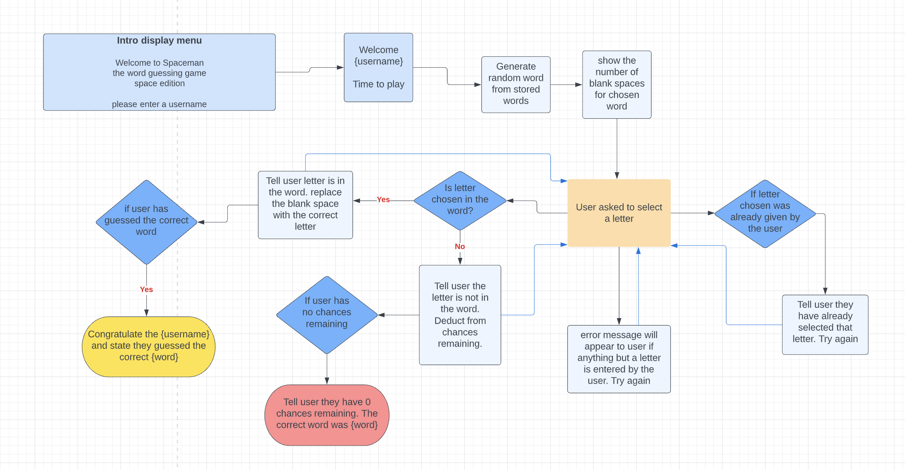

# Spaceman - Portfolio Project 3 Python

## Table of contents
* Introduction
* Concept 
  - Flowchart
* UX
* Design and layout
* Technologies used
* Features to be implemented
* Testing
  - Manual Testing
  - Validation
  - Bugs/Errors
* Deployment
* Credits

## Introduction
This project will use Python to create a word guessing game called Spaceman, a modern day version of the Hangman game. This version of Spaceman
will be space themed and therefore all words will be space related. A number of blank spaces will be displayed and the user will have to guess letter by letter what that word will be. All guesses given by the user will be displayed. Blank spaces will be replaced by their corresponding correct letters if guessed
correctly by the user. If the users guess is incorrect, their chances remaining will be reduced. 
The aim of the game, is for the user to correctly guess the word before they lose all of their chances.

 

## UX 

### User Stories 

#### New user goals
  * As a new user, I want to be given clear instructions to how the game works
  * As a new user, I want to see what guesses I've already made
  * As a new user, I want to know how many chances I have remaining throughout the game

#### Returning user goals
  * As a returning user, I want to be replay the game
  * As a returning user, I want there to be a new word to guess.

### Flowchart 

## Design and Layout

## Technologies Used

- [lucid chart](http://www.lucidchart.com)
  * I used lucid chart to create a flowchart to create the process flow of the game
- [Techsini](https://techsini.com/multi-mockup/)
  *  A multi device image was generated on techsini.com\
- [PEP8](http://pep8online.com/)
  * The online PEP8 validator was used to ensure there were no errors in my python code
- [Heroku](http://heroku.com/)
  * Heroku was used to deploy the game application

## Features to be implemented

## Testing

### User story Testing

### Manual testing

### Validation

### Bugs / Errors

## Deployment

## Credits

