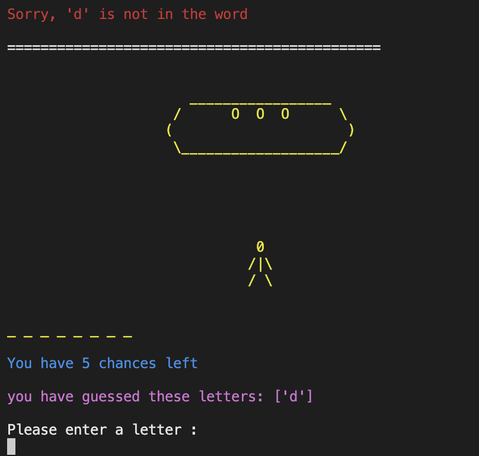
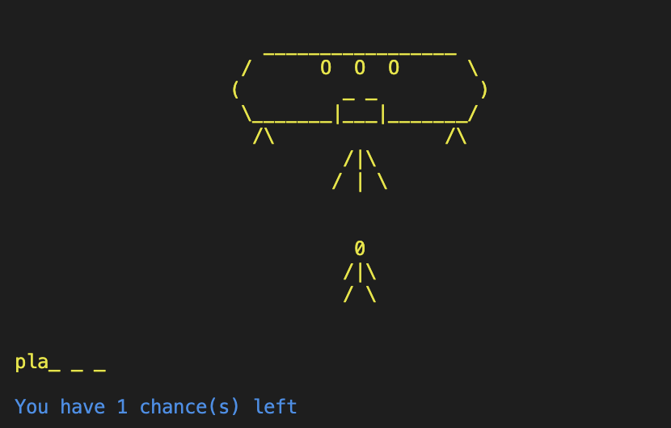

# Spaceman - Portfolio Project 3 Python

## Table of contents
* Introduction
* Concept 
  - Flowchart
* UX
* Design and layout
* Technologies used
* Features to be implemented
* Testing
  - Manual Testing
  - Validation
  - Bugs/Errors
* Deployment
* Credits

## Introduction
This project will use Python to create a word guessing game called Spaceman, a modern day version of the Hangman game. This version of Spaceman
will be space themed and therefore all words will be space related. A number of blank spaces will be displayed and the user will have to guess letter by letter what that word will be. All guesses given by the user will be displayed. Blank spaces will be replaced by their corresponding correct letters if guessed
correctly by the user. If the users guess is incorrect, their chances remaining will be reduced. 
The aim of the game, is for the user to correctly guess the word before they lose all of their chances.

 

## UX 

### User Stories 

#### New user goals
  * As a new user, I want to be given clear instructions to how the game works
  * As a new user, I want to see what guesses I've already made while playing the game
  * As a new user, I want to know how many chances I have remaining throughout the game

#### Returning user goals
  * As a returning user, I want to be replay the game
  * As a returning user, I want there to be a new word to guess.

### Flowchart 

## Design and Layout

### Game banner
The main game header can be seen at every stage of the game. It was created using the pyfiglet library and gives the feel of a real game application
  

### Tagline
The user is given a short synopsis of the game as the application starts.
  
 
### Menu
The menu is seen when the game load. The menu requires user input, asking the user to either read the instructions or go straight to game play
 

### Instructions
If a user is unsure of the game concept, the can view the instructions which gives a few key points about the Spaceman game. From here, the user is asked for further input, to go to game play or to exit the application

### Username
Before gameplay, the user is asked for a username of at least 1 character in length. If no username is entered, they will be asked to enter a valid username.

### The Game
After the username is submitted, the page is refreshed and the user is welcomed to the game. The stick figure appears and the user is asked to enter a letter. The number of chances the user has at each moment, will appear after each round.

### Spaceman Stages
The concept of the game means that for every chance lost, the user is a step closer to being abducted by the aliens. 

#### Stage 1
The game starts off as just the user (the stick drawing).
 
 
    
#### Stage 2 
The spaceship has started to approach
  
  
    
#### Stage 3
The legs on the spaceship have appeared
 
 
    
#### Stage 4
The door on the spaceship has opened
 
 
 
#### Stage 5
A level of beams are seen coming from the spaceship
  
 
 
#### Stage 6 
A second level of beams are seen
  
  
 
#### Stage 7
A third and final level of beams are seen. The user has been caught by the aliens

  
  

## Technologies Used

- [lucid chart](http://www.lucidchart.com)
  * I used lucid chart to create a flowchart to create the process flow of the game
- [Techsini](https://techsini.com/multi-mockup/)
  *  A multi device image was generated on techsini.com\
- [PEP8](http://pep8online.com/)
  * The online PEP8 validator was used to ensure there were no errors in my python code
- [Heroku](http://heroku.com/)
  * Heroku was used to deploy the game application

### Python libraries used

A number of built-in Python libraries were used in the game application

- random : The random library was used to generate a random word from the list of words in the the words.py

- os : The os library was necessary to reset the terminal at certain parts of the game. It can be seen when the user selects an option from the menu and when the game finishes or resets. I did not use this feature in the gameplay itself after each guess as I thought for the user, it would be worth having the option to scroll up and see the illustrations stages in the game. 

- sys : The sys library was needed to add an exit method (sys.exit()) to the 'end of game' and 'thanks for playing' function so that the app would stop running and allow the user to exit the game.

- Colorama :  The colorama library was imported to add colour to text in the terminal. 

- Pyfiglet : The pyfiglet library was installed to convert the normal text 'Spaceman' header into a large art font header.

## Features to be implemented

- A hint feature where the user could ask for a clue regarding the word to be guessed. If a hint is used by the user, their number of chances could be reduced by 1 or 2 to make the game more interesting but also more user friendly.
- A scoreboard feature where the user could check previous scores. Correct word guesses would be ranked from the most chances remaining to least amount of chances.

## Testing

### New user story Testing

- " As a new user, I want to be given clear instructions to how the game works"
  * The menu feature provides an instructions option so the user can be informed before they play"
  
- " As a new user, I want to see what guesses I've already made while playing the game"
  * An updated list of letters guessed by the user appears after each guess is made
  
- " As a new user, I want to know how many chances I have remaining throughout the game"
  * The user is given 6 chances at the beginning of the game to guess the correct word. They're informed of how many chances are left after each guess is made.

#### Returning user goals

- "As a returning user, I want to be replay the game."
  * The game can be played by the user an unlimited amount of times. The user is also given the option to replay the game when they finish the current one.  

- "As a returning user, I want there to be a new word to guess."
  * A variety of 35+ words and the use of the imported random library to generate a random word, gives the user a chance to play the game with a new word to guess each time.

### Manual testing

### Validation

### Bugs / Errors

## Deployment

## Credits

