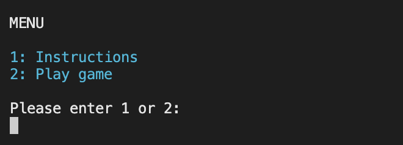
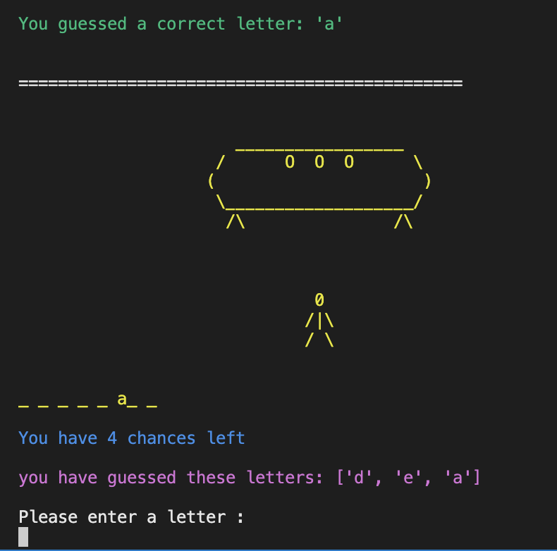

# Spaceman - Portfolio Project 3 Python

## Table of contents
* Introduction
* Concept 
  - Flowchart
* UX
* Design and layout
* Technologies used
* Features to be implemented
* Testing
  - Manual Testing
  - Validation
  - Bugs/Errors
* Deployment
* Credits

## Introduction
This project will use Python to create a word guessing game called Spaceman, a modern day version of the Hangman game. This version of Spaceman is space themed and therefore all words are space related. A number of blank spaces will be displayed and the user will have to guess letter by letter what that word will be. All guesses given by the user will be displayed. Blank spaces will be replaced by their corresponding correct letters if guessed
correctly by the user. If the users guess is incorrect, their chances remaining will be reduced. 
The aim of the game, is for the user to correctly guess the word before they lose all of their chances.

## Concept
Spaceman takes on the concept of the traditional hangman game but with a twist. The aim of the game is to guess the word to avoid being abducted by aliens. The less chances the user has, the closer the spaceship is to the user. If no chances remain, the illustrations provided in the game will show the beams from the spaceship abduct the player. Conversely, if the correct word is guessed, the user escapes the abduction.

### Flowchart 
The flowchart depicts the flow of the game depending on user input.

## UX 

### User Stories 

#### New user goals
  * As a new user, I want to be given clear instructions to how the game works
  * As a new user, I want to see what guesses I've already made while playing the game
  * As a new user, I want to know how many chances I have remaining throughout the game

#### Returning user goals
  * As a returning user, I want to be replay the game
  * As a returning user, I want there to be a new word to guess.

## Design and Layout

I wanted the design to be simple while also making it exciting to play. The colours added to the game, giving it a more fun feel. Therefore improving the users experience of the game.
I also wanted the user to easily navigate through the game with no issues. This was aided by using minimal text where user input was needed so what was asked of the user was simple.

### Game banner
The main game header can be seen at every stage of the game. It was created using the pyfiglet library and gives the feel of a real game application
 
 

### Tagline
The user is given a short synopsis of the game as the application starts.
  
 
### Menu
The menu is seen when the game load. The menu requires user input, asking the user to either read the instructions or go straight to game play
 

### Instructions
If a user is unsure of the game concept, the can view the instructions which gives a few key points about the Spaceman game. From here, the user is asked for further input, to go to game play or to exit the application

### Username
Before gameplay, the user is asked for a username of at least 1 character in length. If no username is entered, they will be asked to enter a valid username.

### The Game
After the username is submitted, the page is refreshed and the user is welcomed to the game. The stick figure appears and the user is asked to enter a letter. The number of chances the user has at each moment, will appear after each round.

### Spaceman Stages
The concept of the game means that for every chance lost, the user is a step closer to being abducted by the aliens. 

#### Stage 1
The game starts off as just the user (the stick drawing).
 
 
 
 
    
#### Stage 2 
The spaceship has started to approach
  
  
  
  
    
#### Stage 3
The legs on the spaceship have appeared
 
 
 
 
    
#### Stage 4
The door on the spaceship has opened
 
 
 
 
 
#### Stage 5
A level of beams are seen coming from the spaceship
  
 
 
 
 
#### Stage 6 
A second level of beams are seen
  
  
  
  
 
#### Stage 7
A third and final level of beams are seen. The user has been caught by the aliens

  
  
  
  
### Game outcomes

#### Correct word
If the user correctly guesses the word before their chances run out, the user is redirected to a congratulations message that tells them they escaped the aliens. They are also given the option to play again. 

#### Incorrect word
If the user does not guess the word in time, they are told they have zero chances remaining and have been caught. They are also given an option to try again.

#### Play again 
If the user wants to play again, they will be redirected straight to gameplay without being asked for a username again. 

#### End of game
If the user decides to exit the game, a message appears and the application ends.

## Technologies Used

- [lucid chart](http://www.lucidchart.com)
  * I used lucid chart to create a flowchart to create the process flow of the game
- [Techsini](https://techsini.com/multi-mockup/)
  *  A multi device image was generated on techsini.com\
- [PEP8](http://pep8online.com/)
  * The online PEP8 validator was used to ensure there were no errors in my python code
- [Heroku](http://heroku.com/)
  * Heroku was used to deploy the game application

### Python libraries used

A number of built-in Python libraries were used in the game application

- random : The random library was used to generate a random word from the list of words in the the words.py

- os : The os library was necessary to reset the terminal at certain parts of the game. It can be seen when the user selects an option from the menu and when the game finishes or resets. I did not use this feature in the gameplay itself after each guess as I thought for the user, it would be worth having the option to scroll up and see the illustrations stages in the game. 

- sys : The sys library was needed to add an exit method (sys.exit()) to the 'end of game' and 'thanks for playing' function so that the app would stop running and allow the user to exit the game.

- Colorama :  The colorama library was imported to add colour to text in the terminal. 

- Pyfiglet : The pyfiglet library was installed to convert the normal text 'Spaceman' header into a large art font header.

## Features to be implemented

- A hint feature where the user could ask for a clue regarding the word to be guessed. If a hint is used by the user, their number of chances could be reduced by 1 or 2 to make the game more interesting but also more user friendly.
- A scoreboard feature where the user could check previous scores. Correct word guesses would be ranked from the most chances remaining to least amount of chances.

## Testing

### New user story Testing

- " As a new user, I want to be given clear instructions to how the game works"
  * The menu feature provides an instructions option so the user can be informed before they play"
  
- " As a new user, I want to see what guesses I've already made while playing the game"
  * An updated list of letters guessed by the user appears after each guess is made
  
- " As a new user, I want to know how many chances I have remaining throughout the game"
  * The user is given 6 chances at the beginning of the game to guess the correct word. They're informed of how many chances are left after each guess is made.

#### Returning user goals

- "As a returning user, I want to be replay the game."
  * The game can be played by the user an unlimited amount of times. The user is also given the option to replay the game when they finish the current one.  

- "As a returning user, I want there to be a new word to guess."
  * A variety of 35+ words and the use of the imported random library to generate a random word, gives the user a chance to play the game with a new word to guess each time.

### Manual testing
I tested the game manually at different steps throughout the game to ensure the correct outcome occurred. 

#### Menu Options
* I ensured that when '1' was entered, the user was directed to the instructions. 
* If '2' was entered, the user was redirected straight to choosing a username.
* If an option, not '1' or '2' was entered, an error message would appear asking for a valid option.

#### Valid Username
* I checked to ensure that if a user did not give any input for the username, that they would be displayed an error message asking them for a valid username. When a username of 1 character or more is entered, the user is welcomed and are redirected to gameplay.

#### Valid letter guess

##### Already guessed
* I checked that if a letter that had already been guessed was input, then an error message stating 'you have already guessed this letter' will appear. I also made sure it didn't effect the amount of chances remaining

  
##### Multiple letters
* If more than one letter is input by the user, an error message will show to say to 'please enter one letter at a time'

  
##### Special Characters
* I ensured that if input is not included in the alphabet, then an error message will display to the user saying to 'enter a valid letter'

A number of other checks were done to ensure the application worked as it should.

1) If the correct word was guessed, I made sure the game play ended and the user was redirected and asked if they would like to play again.
2) I ensured the number of chances decreased 1 by 1 as wrong guesses were made.
3) If the number of chances remaining were equal to 0, I made sure the game ended and the illustrations were inline with the result. The user would be given the option to replay.
4) I checked that if the user wanted to replay the game that they were redirected straight to game play
5) If the user wanted to exit the game, I made sure that the app closed.

### Validation
I validated my Python code using the online [PEP8](http://pep8online.com/) validator.
Initially, minor errors appeared including 'trailing whitespace' and 'too many blank lines'.

This errors were fixed and the final code was ran for both my run.py and words.py files. 
Both showed no errors.

#### PEP8 run.py validated

#### PEP8 words.py validated

### Bugs/Errors

* Minor errors found through the PEP8 validator were fixed.

* An initial error found in the code, was that chances remaining decreased when letters already guessed wrong were entered again, aswell as invalid inputs. I fixed this by nesting an if statement within an if/elif/else statement so that they chances remaining were only deducted from if the letter guessed was in the alphabet but not in the correct word.

## Deployment

* This project was created in gitpod and deployed using Heroku.
* A number of steps were carried out to ensure a successful deployment. 
* The final code was pushed to github and then heroku was used.

1) On the Heroku website, log in to your account once signed up.
2) Click on "create new app" once logged in.
3) Give the app a name and choose the correct region, USA or Europe
4) Click on the settings tab 
5) Once in settings, go to the "Config Vars" and add the KEY:PORT and the VALUE:8000
6) After, go to the "buildpacks" section and add buildbacks 'Python' and 'node.js'
7) Go to the deployment section and click on the 'connect to Github' option
8) Choose the repository name you want to deploy and click 'connect'.
9) Choose between the 'automatic' and 'manual' deploys
10) Finally select the branch to deploy and heroku will build the final live app.

## Credits

### Code

* A mention to stack overflow and the code institute slack groups for help along the way.
* Credit to [geeks for geeks](https://www.geeksforgeeks.org/python-exit-commands-quit-exit-sys-exit-and-os-_exit/) that gave me the idea for the exit function using the sys library as well as using the pyfiglet library to create ASCII art font for the main game banner.
* Credit to [Dev to](https://dev.to/visheshdvivedi/get-colored-console-output-in-python-using-colorama-4gci) for informing me on colorama and how to use it.
* Credit to the 'Kite' channel on youtube. The use of code for the illustrations was adapted from their channel.

### Acknowledgements 

* A special mention to my mentor, Narender Singh who gave me great feedback and advice for the project.
* Thanks to my family who played the game multiple times and gave me helpful user feedback.
* Thanks to Scott and Ed at the code Institute for help with a few deployment issues I had.

